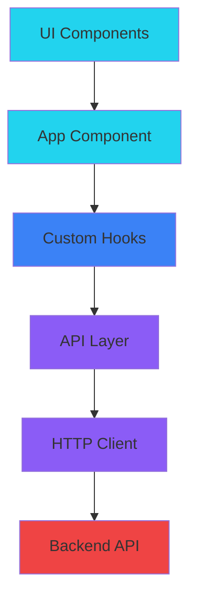
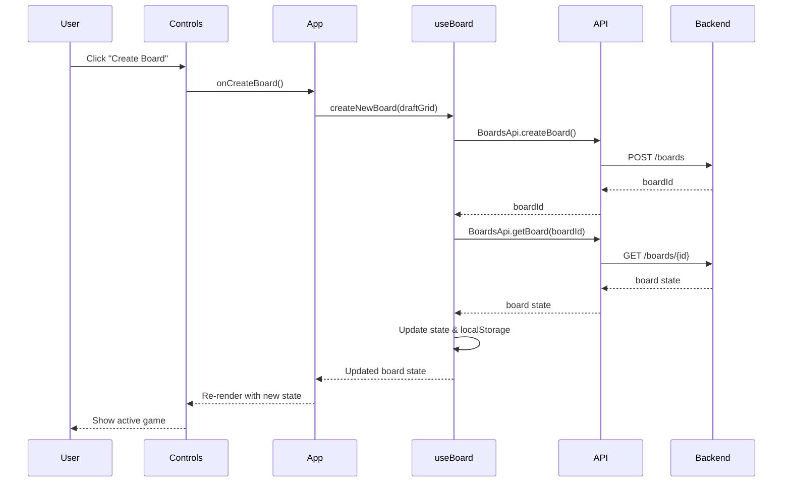
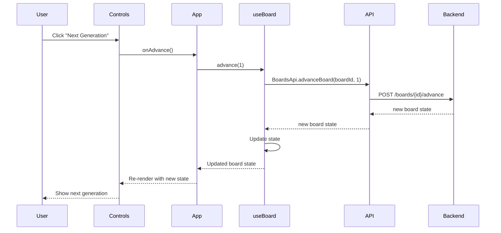

# Conway's Game of Life - Architecture Documentation

## Overview

This application is a React-based frontend fClient or Conway's Game of Life that communicates with a backend API to handle game logic. The architecture follows a clean separation of concerns with distinct layers for presentation, business logic, and data access.

## Architecture Diagram



## Layer Architecture

### 1. UI Components Layer

**Location**: `src/components/`

**Responsibility**: Renders the user interface and handles user interactions.

**Components**:
- **Cell**: Displays a single cell (alive or dead) with visual styling
- **Grid**: Renders the complete game board as a grid of cells
- **Controls**: Provides buttons and inputs for game control (create, advance, reset)
- **Toast**: Shows error notifications to the user

**Key Characteristics**:
- Components are presentational and mostly stateless
- Receive data via props
- Communicate user actions upward through callback functions
- No direct knowledge of API or business logic
- Styled using Tailwind CSS for consistent React-themed design

### 2. Application Layer

**Location**: `src/App.tsx`

**Responsibility**: Orchestrates the application flow and manages high-level state.

**Key Functions**:
- Coordinates between UI components and custom hooks
- Manages draft grid state (before game starts)
- Handles user interactions (creating boards, toggling cells, resetting)
- Controls which view to show (draft mode vs active game mode)
- Manages error display through Toast notifications

**State Management**:
- Draft grid configuration (rows, columns, cell states)
- Error messages for user notifications

### 3. Business Logic Layer

**Location**: `src/hooks/useBoard.ts`

**Responsibility**: Manages game state and coordinates with the API.

**Key Functions**:
- `recoverPreviousSessionIfAny()`: Restores game from localStorage on app load
- `createNewBoard()`: Creates a new game board with initial configuration
- `advance()`: Advances the game by one or more generations
- `resetBoard()`: Clears current game and returns to draft mode

**State Management**:
- Board ID (for API communication)
- Board state (grid and generation count)
- Loading state (for UI feedback during API calls)

**Persistence**:
- Stores board ID in localStorage for session recovery
- Automatically recovers previous session on app initialization

### 4. API Layer

**Location**: `src/api/`

**Responsibility**: Handles all HTTP communication with the backend.

**Structure**:

#### HTTP Client (`axiosConfig.ts`)
- Configures axios instance with base URL and timeout
- Implements response interceptor for centralized error handling
- Transforms technical errors into user-friendly messages
- Handles common scenarios:
  - Network errors (backend unavailable)
  - Server errors (5xx status codes)
  - Client errors (4xx status codes)
  - Timeout errors

#### API Service (`BoardsApi.ts`)
- Provides functions for each API endpoint:
  - `getBoard()`: Retrieves board state by ID
  - `createBoard()`: Creates a new board with initial grid
  - `advanceBoard()`: Advances board by specified generations
- Uses the configured HTTP client for all requests
- Returns typed responses

#### HTTP Contracts
We follow a **dogmatic approach** by replicating the API contracts exactly as defined by the backend. This means:
- Request and response types mirror the backend's DTOs
- No transformation or mapping logic in the API layer
- Direct one-to-one relationship between frontend and backend models
- Changes to API contracts require updates in both frontend and backend

**Example**:
```typescript
// Request matches backend DTO exactly
interface CreateBoardRequest {
  initialGrid: number[][];
}

// Response matches backend DTO exactly
interface GetBoardResponse {
  grid: number[][];
  generation: number;
}
```

### 5. Utilities Layer

**Location**: `src/utils/`

**Responsibility**: Provides helper functions used across the application.

**Functions**:
- `createEmptyGrid()`: Generates an empty grid with specified dimensions

## Data Flow

### Creating a New Board



### Advancing the Game



## Error Handling

Errors are handled at multiple levels:

1. **API Layer**: Intercepts HTTP errors and transforms them into user-friendly messages
2. **Business Logic Layer**: Catches errors and passes them to the presentation layer
3. **Application Layer**: Displays errors to users via Toast notifications

**Error Flow**:
```
Backend Error → Axios Interceptor → User-Friendly Message → useBoard Hook → App Component → Toast Component → User
```

## State Management Strategy

The application uses React's built-in state management:

- **Local Component State**: For UI-specific state (draft grid, error messages)
- **Custom Hooks**: For shared business logic and API communication (useBoard)
- **localStorage**: For session persistence (board ID)

This approach is sufficient for the application's complexity and avoids the overhead of external state management libraries.

## Design Principles

1. **Separation of Concerns**: Each layer has a clear, single responsibility
2. **Unidirectional Data Flow**: Data flows down through props, events bubble up through callbacks
3. **API Agnostic Components**: UI components have no knowledge of the API or backend
4. **Error Resilience**: Comprehensive error handling at every level
5. **Session Persistence**: Automatic recovery of previous game sessions
6. **Loading States**: Clear feedback during asynchronous operations
7. **Dogmatic API Contracts**: Exact replication of backend contracts for consistency

## Technology Stack

- **React**: UI library with TypeScript for type safety
- **Axios**: HTTP client for API communication
- **Tailwind CSS**: Utility-first CSS framework for styling
- **Vite**: Build tool and development server
- **localStorage**: Browser storage for session persistence

## Future Considerations

If the application grows in complexity, consider:

- Adding a state management library (Redux, Zustand) for more complex state
- Implementing optimistic UI updates for better perceived performance
- Adding unit tests for business logic and integration tests for API layer
- Implementing WebSocket connection for real-time multiplayer features
- Adding service worker for offline functionality